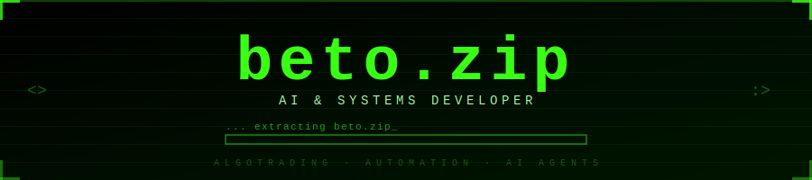

<!-- ████████████████████████████████████████████████████████████ -->
<!-- ░░░░░░░░░░░  BETO.ZIP — GITHUB PROFILE README  ░░░░░░░░░░░ -->
<!-- ████████████████████████████████████████████████████████████ -->

<div align="center">


<!-- PROFILE PICTURE — GitHub avatar via API (always works) -->
<br/>

<br/>

<!-- TYPING ANIMATION -->
[](https://git.io/typing-svg)

<br/>

<!-- BADGES ROW -->

&nbsp;

&nbsp;

&nbsp;
[](https://github.com/dev-be)

</div>

<!-- ═══════════════════════════════════════════════ -->

<br/>

<div align="center">

```
┌──────────────────────────────────────────────────────────────────────────┐
│                                                                          │
│    ██████╗ ███████╗████████╗ ██████╗    ███████╗██╗██████╗               │
│    ██╔══██╗██╔════╝╚══██╔══╝██╔═══██╗   ╚══███╔╝██║██╔══██╗              │
│    ██████╔╝█████╗     ██║   ██║   ██║     ███╔╝ ██║██████╔╝              │
│    ██╔══██╗██╔══╝     ██║   ██║   ██║    ███╔╝  ██║██╔═══╝               │
│    ██████╔╝███████╗   ██║   ╚██████╔╝   ███████╗██║██║                   │
│    ╚═════╝ ╚══════╝   ╚═╝    ╚═════╝    ╚══════╝╚═╝╚═╝                   │
│                                                                          │
│    > AI & Systems Developer                                              │
│    > Algorithmic Trading  ·  Automation  ·  AI Agents                    │
│                                                                          │
└──────────────────────────────────────────────────────────────────────────┘
```

</div>

<br/>

<!-- ═══════════════ ABOUT ═══════════════ -->

```bash
$ cat /proc/beto/identity
```

<table>
<tr>
<td width="50%" align="top">

```python
class Developer:

    name    = "beto.zip"
    role    = "AI & Systems Developer"
    based   = ["🇧🇷 Brazil", "🇮🇹 Italy"]

    focus = [
        "Algorithmic Trading",
        "AI Agents & LLMs",
        "Automation Pipelines",
        "Backend Engineering",
        "Data Infrastructure",
    ]

    philosophy = """
      Build systems that think.
      Automate everything possible.
      Let code do the heavy lifting.
    """

    status = "[ ██████████████ ] SHIPPING"
```

</td>
<td width="50%" align="top">

```
╔══════════════════════════════════╗
║   LIVE SYSTEM METRICS            ║
╠══════════════════════════════════╣
║                                  ║
║  AGENTS    ▓▓▓▓▓▓▓▓▓▓  RUNNING   ║
║  PIPELINES ▓▓▓▓▓▓▓▓░░  ACTIVE    ║
║  BOTS      ▓▓▓▓▓▓▓▓▓▓  LIVE      ║
║  APIS      ▓▓▓▓▓▓▓░░░  ONLINE    ║
║  COMMITS   ▓▓▓▓▓▓▓▓▓░  DAILY     ║
║                                  ║
║  MARKET FEED  ●  STREAMING       ║
║  MT5 BRIDGE   ●  CONNECTED       ║
║  N8N ENGINE   ●  PROCESSING      ║
║                                  ║
╚══════════════════════════════════╝
```

</td>
</tr>
</table>

<br/>

<!-- ═══════════════ AREAS ═══════════════ -->

```bash
$ ls -la ./domains/ --sort=priority
```

<div align="center">

| MODULE | DESCRIPTION | STACK |
|:---|:---|:---|
| `📈 algorithmic_trading/` | Bots, signal engines, market execution & risk management | MT5 · Python · Redis |
| `🤖 ai_agents/` | LLM-powered autonomous agents with memory & tool use | OpenAI · FastAPI · PostgreSQL |
| `⚙️ automation_systems/` | End-to-end workflow automation and process orchestration | n8n · Docker · APIs |
| `🔧 backend_engineering/` | Scalable APIs, microservices and data infrastructure | FastAPI · PostgreSQL · Linux |
| `🔌 data_pipelines/` | Real-time data collection, transformation and distribution | Scrapers · Airflow · Redis |
| `🔗 system_integrations/` | Connecting heterogeneous services and platforms at scale | REST · Webhooks · n8n |

</div>

<br/>

<!-- ═══════════════ PROJECTS ═══════════════ -->

```bash
$ cat ./projects/featured.log
```

```
╔═══════════════════════════════════════════════════════════════════════════╗
║  PROJECT INDEX  //  beto.zip  //  featured builds                         ║
╠═══════════════════════════════════════════════════════════════════════════╣
║                                                                           ║
║  [01] ALGOTRADER CORE                                      [ACTIVE] 🟢    ║
║       Modular algorithmic trading engine built on MT5 API.                ║
║       Strategy execution, market data ingestion, risk control             ║
║       and automated order management in real-time.                        ║
║       Stack → Python · MetaTrader5 · FastAPI · Redis · PostgreSQL         ║
║                                                                           ║
║  [02] AI AGENT FRAMEWORK                                   [ACTIVE] 🟢    ║
║       Orchestration layer for multi-step autonomous agents.               ║
║       Supports tool use, memory, context and integration                  ║
║       with external APIs for complex task execution.                      ║
║       Stack → Python · LLM APIs · FastAPI · PostgreSQL · Docker           ║
║                                                                           ║
║  [03] DATAPIPELINE ENGINE                                  [ACTIVE] 🟢    ║
║       Modular pipeline for collecting, transforming and                   ║
║       distributing data from multiple sources. Powers                     ║
║       dashboards, AI workflows and real-time alert systems.               ║
║       Stack → Python · n8n · Docker · PostgreSQL · Redis                  ║
║                                                                           ║
╚═══════════════════════════════════════════════════════════════════════════╝
```

<br/>

<!-- ═══════════════ TECH STACK ═══════════════ -->

```bash
$ cat ./config/tech_stack.json | jq '.'
```

<div align="center">

**`// LANGUAGES`**


**`// BACKEND`**


**`// FRONTEND`**


**`// DATABASES`**


**`// INFRASTRUCTURE`**


**`// AUTOMATION & AI`**


**`// FINANCIAL SYSTEMS`**


</div>

<br/>

<!-- ═══════════════ CURRENTLY LOADING ═══════════════ -->

```bash
$ tail -f /var/log/beto/learning.log
```

```
══════════════════════════════════════════════════════════════════
  PROCESS      PROGRESS                           ETA
══════════════════════════════════════════════════════════════════
  Machine Learning      ▓▓▓▓▓▓▓▓▓░  87%          soon™
  Distributed Systems   ▓▓▓▓▓▓▓░░░  72%          in progress
  Advanced AI Agents    ▓▓▓▓▓▓▓▓▓▓  93%          almost there
══════════════════════════════════════════════════════════════════
  [!] WARNING: knowledge absorption rate exceeding safe limits
```

<br/>

<!-- ═══════════════ GITHUB STATS ═══════════════ -->

```bash
$ github-stats --user dev-be --theme neon --verbose
```

<div align="center">


</div>

<div align="center">

[](https://git.io/streak-stats)

</div>

<div align="center">

[](https://github.com/ashutosh00710/github-readme-activity-graph)

</div>

<br/>

<!-- ═══════════════ CONNECT ═══════════════ -->

```bash
$ ./open_channels --all --encrypted
```

<div align="center">

[](https://github.com/dev-be)

</div>

<br/>

<!-- ═══════════════ FOOTER ═══════════════ -->

<div align="center">

```
╔═══════════════════════════════════════════════════════════════════════════╗
║                                                                           ║
║   $ beto.zip --extract --compile --deploy --run --infinite                ║
║                                                                           ║
║   OUTPUT  ▸  systems operational                                          ║
║   OUTPUT  ▸  agents active                                                ║
║   OUTPUT  ▸  pipelines flowing                                            ║
║   OUTPUT  ▸  trades executing                                             ║
║                                                                           ║
║   STATUS  ▸  [ ██████████████████████████████ ]  100%  COMPLETE           ║
║                                                                           ║
╚═══════════════════════════════════════════════════════════════════════════╝
```

*`caffeine` · `terminal sessions` · `market data at 3am` · `n8n at midnight`*

</div>

<!-- ANIMATED FOOTER WAVE -->

